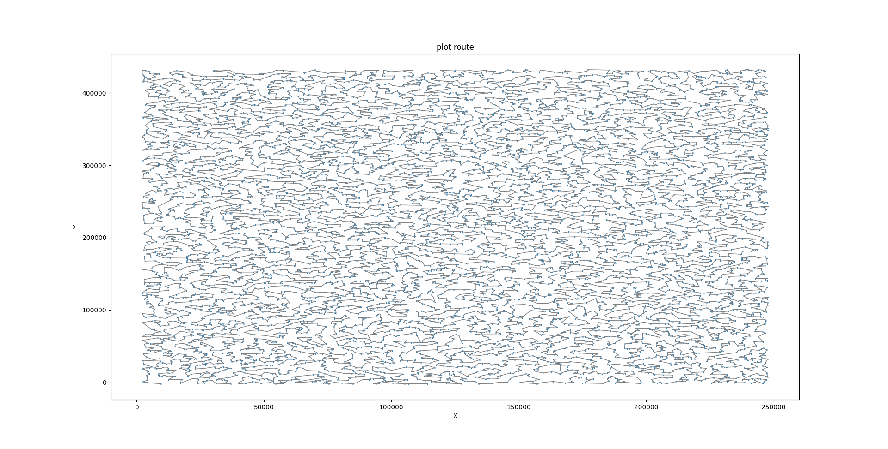

# PCB-RouteOpt


## Introduction

**PCB-RouteOpt** is an advanced algorithm designed to **optimize laser drilling paths** for large PCB layouts. This algorithm significantly improves processing efficiency, reducing laser machining time by **`6% to 15%`**. It outperforms the **Nvidia cuOpt** solution by achieving better results with lower computational power and time consumption.

## Background

With advancements in electronic technology, PCB layouts have become larger and component density has increased. This poses higher demands on laser drilling machines, especially when dealing with tens of thousands of coordinate points. Traditional algorithms often struggle to process such large datasets within a reasonable timeframe. The main challenges and solutions are as follows:

- **Challenges**:
  - **Large-Scale Data Processing**: Processing a vast number of coordinate points can be slow with traditional algorithms.
  - **Production Bottleneck**: The efficiency of laser drilling machines can limit overall production speed.
  - **Optimization Difficulty**: Finding the shortest path involves complex calculations, and traditional methods may not find near-optimal solutions.

- **Solutions**:
  - **Efficient Algorithm**: Our algorithm provides a fast and reasonable drilling path solution.
  - **Dual Optimization Strategy**: Combines **`greedy`** and **`2-opt`** strategies for enhanced path optimization.
  - **Data Processing Optimization**: Utilizes **numpy** for data structure improvements and efficient computations, ensuring rapid processing and high performance.


## Quickstart

To get started with `PCB-RouteOpt`, follow these steps:

1. **Clone the Repository**:
    ```sh
    git clone [Project URL]
    cd pcb_routeopt
    ```

2. **Install Dependencies**:
    ```sh
    pip install -r requirements.txt
    ```

3. **Get Help**: Display help message to understand the usage:
    ```sh
    python pcb_routeopt/main.py --help
    ```

## Example

Due to **confidentiality**, we cannot disclose real PCB path data. In the `data/coords_df.csv` file, there are **11,846 coordinate points**. The algorithm calculates the distance matrix for these points, performs an initial **greedy optimization**, and then refines the path using **2-opt** techniques. The final result is saved in **JSON format** and visualized for review.


## Output Example

Here is an example of the optimized path based on the `data/coords_df.csv` file:



## License

This project is licensed under the terms of the `MIT license`. For more details, see the [LICENSE](LICENSE) file.

## Contact Information

- **Author**: `HungCheng Chen`
- **Email**: [hcchen.nick@gmail.com](mailto:hcchen.nick@gmail.com)
